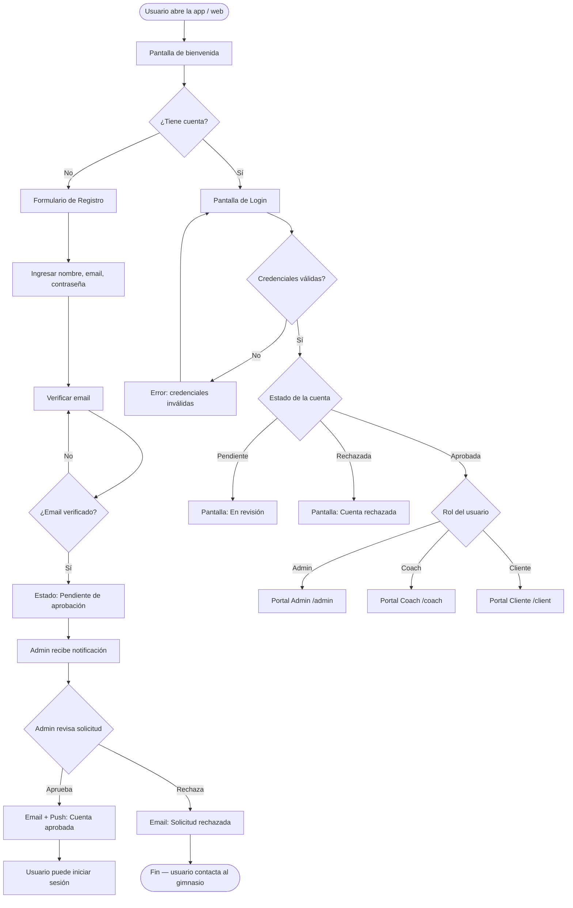
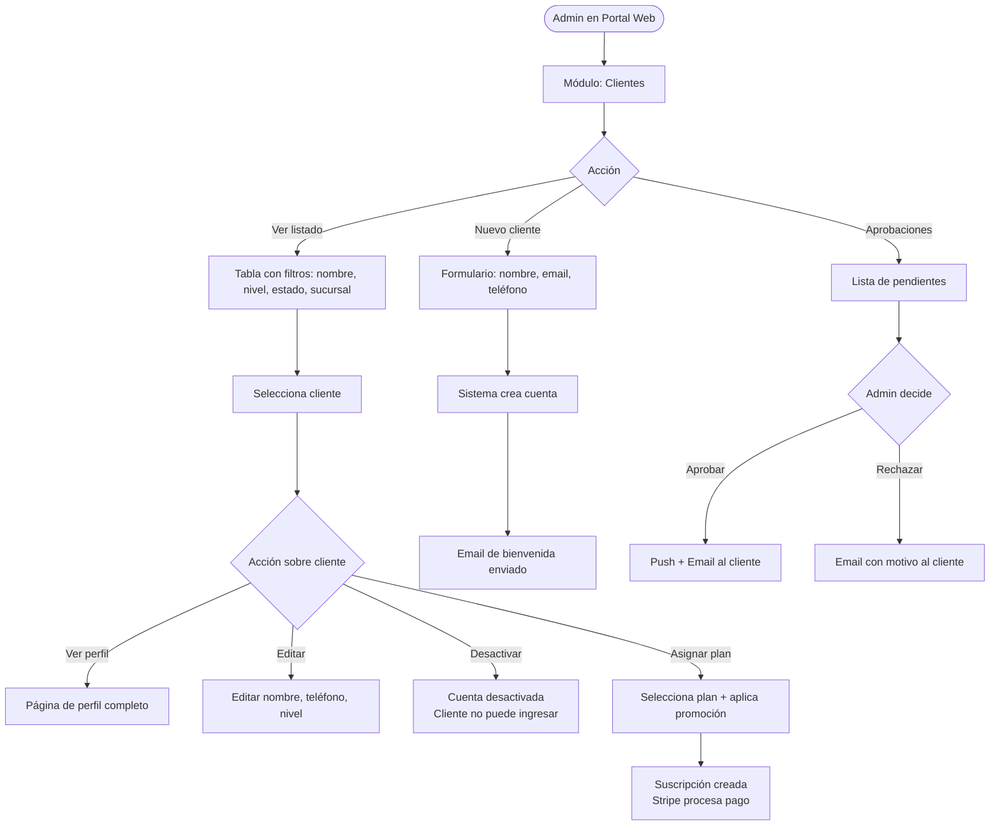
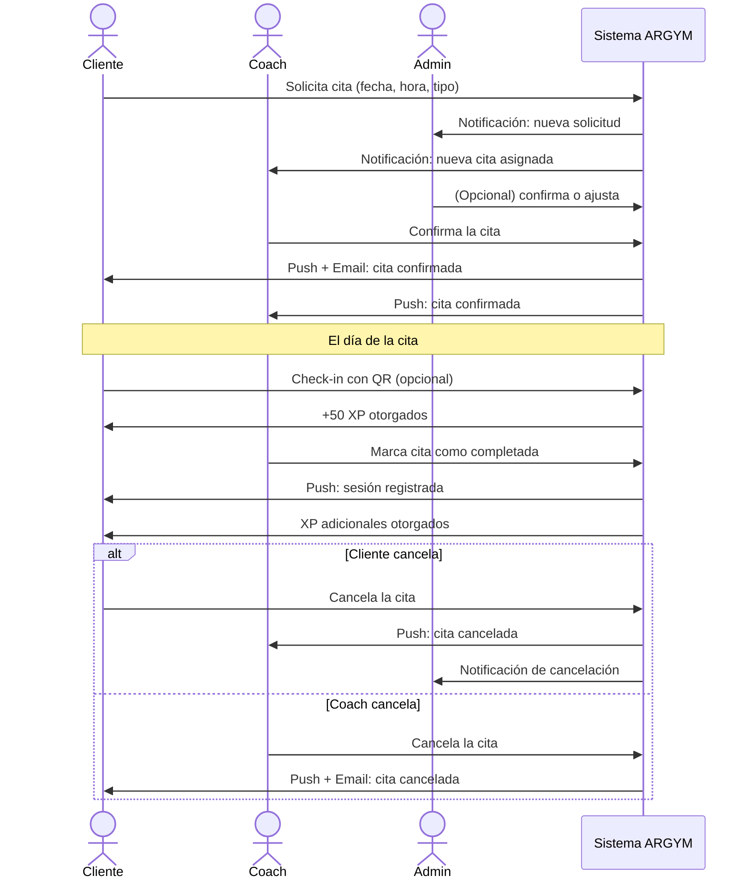
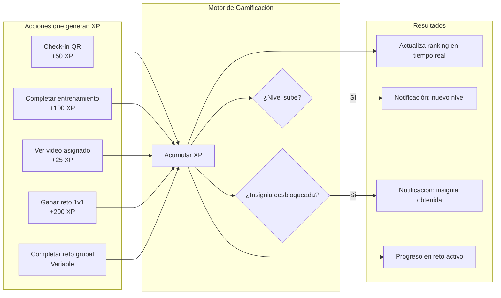
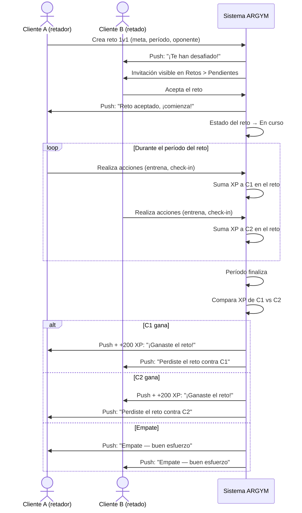
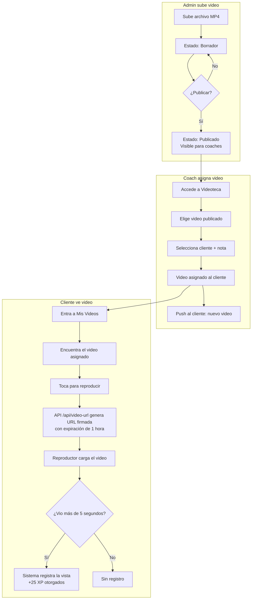
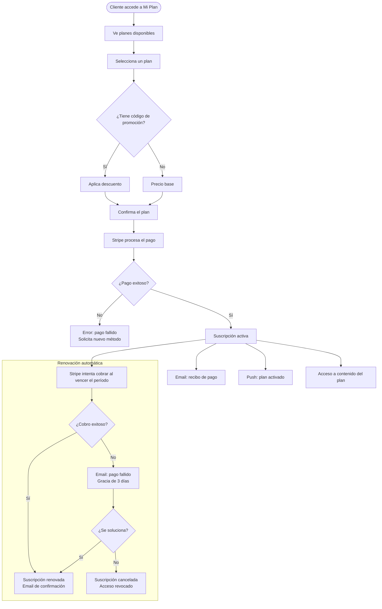
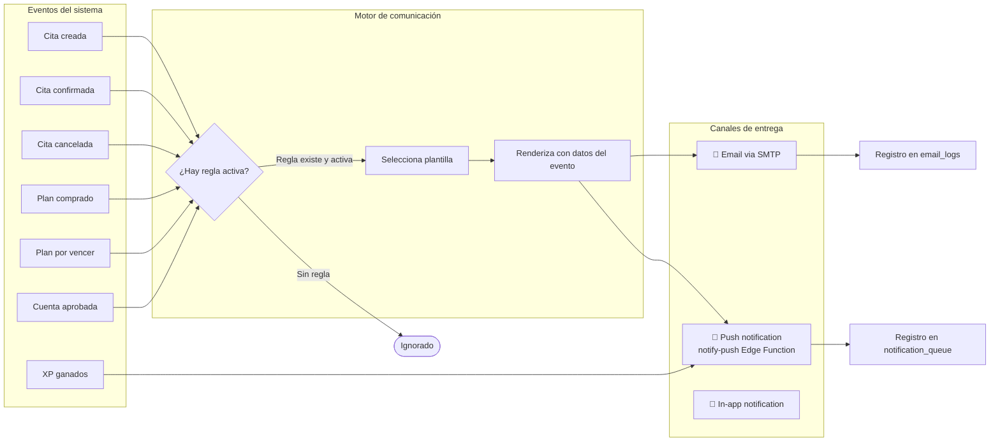
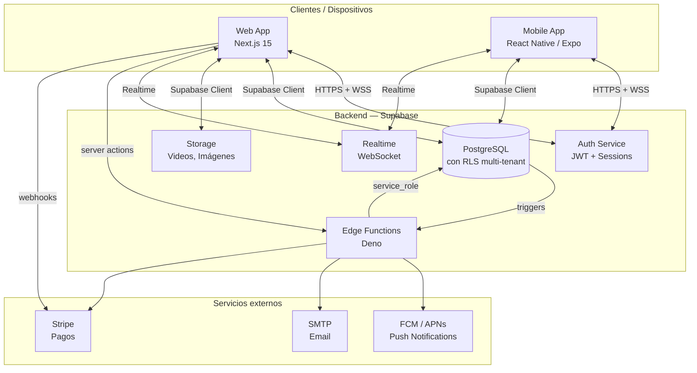

# Diagramas de Flujo — ARGYM Platform
> Diagramas en sintaxis Mermaid. Renderiza con cualquier editor compatible: GitHub, GitLab, Obsidian, VS Code (extensión Mermaid), o [mermaid.live](https://mermaid.live).

---

## 1. Flujo de Registro y Aprobación de Usuario

---

## 2. Flujo de Gestión de Clientes (Admin)

---

## 3. Flujo de Gestión de Citas

---

## 4. Flujo de Gamificación

---

## 5. Flujo de Reto 1v1

---

## 6. Flujo de Videos (Asignación y Reproducción)

---

## 7. Flujo de Suscripciones y Pagos (Stripe)

---

## 8. Flujo de Notificaciones y Comunicación Automática

---

## 9. Arquitectura General de la Plataforma

---

*Renderiza estos diagramas en [mermaid.live](https://mermaid.live) o en cualquier editor Markdown con soporte Mermaid.*
